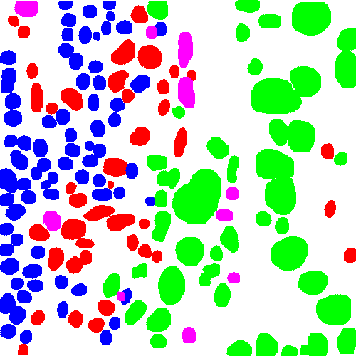

# Histological based Patch Segmentatin, Whole Slide Nuclei Segmentation and TME Feature Extraction Pipeline


Author: **Ruichen Rong** (ruichen.rong@utsouthwestern.edu)


## Introduction
This pipeline is designed for image patch and whole slide level nuclei detection, segmentation and TME feature extraction. The pipeline contains three components. 

The first component (`run_patch_inference.py`) runs a pretrained object detection/segmentation model on image patchs and outputs nuclei locations, types and masks. This process can be done in realtime and is integrated into our realtime deepzom server.

   Sample input patch      |    Nuclei segmentation
:-------------------------:|:-------------------------:
|


The second component (`run_wsi_inference.py`) applies a pretrained object detection/segmentation model on whole slide images and outputs nuclei locations, types and masks. Results can be viewed through deepzoom server.

   Sample input slide      |    Nuclei segmentation
:-------------------------:|:-------------------------:
|

The third component (`summarize_tme_features.py`) extract nuclei morphological features and further utilizes density-based feature extraction module to summarize slide level and ROI level TME features. All nuclei detected above will be allocated into a 2d point cloud and further smoothed into a density maps that reflect nuclei distribution. Then multiple Delaunay graph based and density based TME features will be calculated.

   Nuclei scatter plot     |    Nuclei density plot
:-------------------------:|:-------------------------:
  |  


## Installation
Dependencies can be installed through conda environment. A GPU device is recommended to run the WSI script (`run_wsi_inference.py`) on large dataset. GPU memory depends on the model size and batch size. By default, the `Yolo_mask` model takes 12GB memory for optimized performance. 

### Build conda environment on BioHPC
Step 1. Login into a delegate GPU node and load modules(e.g. 172.18.225.252, 172.18.227.84, 172.18.227.85)
```
ssh username@172.18.225.252
module add python/3.8.x-anaconda
```
Step 2. clone the repo and install the environment:
```
git clone https://git.biohpc.swmed.edu/QBRC/deep-learning/development/hd_wsi.git
cd hd_wsi
conda env create --prefix /path/to/conda/env/ -f z.ml_env2_1.10.1.yaml
conda activate /path/to/conda/env/
```

Step 3. Download pretrained models from BioHPC. Pretrained `Yolo_mask` models are provided for lung cancer and breast cancer. Copy them into `hd_wsi` folder or specify your own model. (The default models used in the script are `benchmark_lung/lung_best.float16.torchscript.pt` and `benchmark_nucls_paper/fold3_epoch201.float16.torchscript.pt`)
```
cp -r /project/DPDS/Xiao_lab/shared/RuichenRong/Packages/hd_wsi/selected_models/ hd_wsi/
```
When building pipeline with customized model, the pytorch model should be in eval mode and has standard object detection output format `(losses: Optional, outputs: Dict[str, torch.Tensor])` with required keys: `'boxes'`, `'labels'`, `'scores'`, and optional keys `'masks'`, `'keypoints'`, etc in `outputs`. (See [torchvision MaskRCNN](https://pytorch.org/tutorials/intermediate/torchvision_tutorial.html#defining-the-dataset) format for details). The pytorch model should then be converted into a [torchscript](https://pytorch.org/docs/stable/jit.html) model under the **same pytorch version** installed in the environment. (torchscript ops are not consistent between different pytorch version. Be caucious with compatibility issue.)


## User Guideline
### a) Image patch nuclei segmentation
The script `run_patch_inference.py` analyzes a single image patch or a folder of image patches with given model and outputs nuclei detection and segmentation results. Image patches are analyzed one-by-one without parallel, so image patches with different sizes are allowed. By default, model uses breast cancer `Yolo_mask` model to segment the following nuclei: tumor, stromal, immune, blood, macrophage, necrosis and others. mpp need to be specified with option `--mpp`. The script will automatically align image patch scale to default scale (mpp=0.25, 40x) during inference and convert result to the original input size. Run `python run_patch_inference.py -h` for all options.

Example 1. Produce the result of a 40x lung cancer image patch displayed in the introduction:
```
python run_patch_inference.py --data_path assets/9388_1_1.png --output_dir ./ --device cpu
```

Example 2. Run lots of 20x patches with mpp=0.5 on GPU
```
python run_patch_inference.py --data_path /path/to/patch_folder --output_dir /path/to/output_patches --mpp 0.5
```


### b) Whole slide nuclei detection and segmentation
The script `run_wsi_inference.py` accepts a single slide or a folder of slides as inputs and outputs nuclei detection and segmentation results from given model. By default, model uses breast cancer `Yolo_mask` model to detect the following nuclei: tumor, stromal, immune, blood, macrophage, necrosis and others. Slides with different magnification and mpp will be aligned to mpp=0.25 (40x) during inference but convert back to the original mpp and scale in results. Run `python run_wsi_inference.py -h` for all options.


Example 1. Quick start with pretrained breast cancer model on the sample BRCA slide with default options:
```
CUDA_VISIBLE_DEVICES=0 python -u run_wsi_inference.py --data_path sample.svs --output_dir test_wsi
```

Example 2. Detect only box on cpu with the default lung cancer model and export result to csv
```
python -u run_wsi_inference.py --data_path sample.svs --model_path lung --output_dir test_wsi_box_only --device cpu --box_only --save_csv
```

Example 3. Run a large customized RCNN model on a folder of slides with annotations. Export results to image, and save mask and text information into csv file.
```
CUDA_VISIBLE_DEVICES=1 python -u run_wsi_inference.py \
--data_path /path/to/folder \
--meta_info text_color_info.yaml \
--model_path /path/to/model/ \
--output_dir /path/to/output_wsi \
--batch_size 4 --roi tissue
--save_img --save_csv \
--export_mask --export_text
```

### c) Nuclei and TME feature extraction
The script `summarize_tme_features.py` takes the outputs from *a)* to extract a variety of nuclei and TME features. Currently, the following nuclei features and TME features are calculated:
<details>
    <summary> Nuclei morphological features </summary>
    <ul>
        <li> i.radius: average radius for nuclei type_i base on bounding bx size. </li>
        <li> i.total: total amount of nuclei type_i detected in results file. </li>
        <li> i.box_area.*: statistics of bounding box area of type_i. </li>
        <li> i.area.*: statistics of mask area of type_i. </li>
        <li> i.convex_area.*: statistics of mask convex_area of type_i. </li>
        <li> i.eccentricity.*: statistics of mask eccentricity of type_i. </li>
        <li> i.extent.*: statistics of mask extent of type_i. </li>
        <li> i.filled_area.*: statistics of mask filled_area of type_i. </li>
        <li> i.major_axis_length.*: statistics of mask major_axis_length of type_i. </li>
        <li> i.minor_axis_length.*: statistics of mask minor_axis_length of type_i. </li>
        <li> i.orientation.*: statistics of mask orientation of type_i. </li>
        <li> i.perimeter.*: statistics of mask perimeter of type_i. </li>
        <li> i.solidity.*: statistics of mask solidity of type_i. </li>
        <li> i.pa_ratio.*: statistics of mask pa_ratio (perimeter ** 2 / filled_area) of type_i. </li>
    </ul>
</details>

<details>
    <summary> Delaunay graph based features </summary>
    <ul>
        <li> i_j.edges.mean: average nuclei distance of type_i &lt;-&gt; type_j interactions. </li>
        <li> i_j.edges.std: nuclei distances std of type_i &lt;-&gt; type_j interactions. </li>
        <li> i_j.edges.count: total No. of type_i &lt;-&gt; type_j interactions in all patches. </li>
        <li> i_j.edges.marginal.prob: i_j.edges.count/sum(x_y.edges.count), percentage of type_i &lt;-&gt; type_j interaction. </li>
        <li> i_j.edges.conditional.prob: i_j.edges.count/sum(x_j.edges.count), edge probability condition to type_j interaction. </li>
        <li> i_j.edges.dice: dice coefficient of i_x.edges and y_j.edges, overlap over union of type_i interaction and type_j interaction. </li>
    </ul>
</details>

<details>
    <summary>Density based features </summary>
    <ul>
        <li> roi_area: overall tumor/tissue region.
        <li> i_j.dot: dot product between type_i and type_j.
        <li> i.norm: norm2(type_i), type_i density. </li>
        <li> i_j.proj: i_j.dot / j.norm, influence of type_i on type_j. </li>
        <li> i_j.proj.prob: use sigmoid activation to normalize i_j.proj into 0~1. </li>
        <li> i_j.cos: i_j.dot/i.norm/j.norm, similarity of type_i and type_j. </li>
    </ul>
</details>

By default, Delaunay graph based features are summarized from a maximum of 10 random selected patches (2048*2048) in tumor region. Density based features are calculated with kernel smoothed density map that is 1/32 of the original image scale. Parameters can be changed based on needs, run `python summarize_tme_features.py -h` for detailed information about all options.

Example 1. Analyze results from `sample.svs` and save plots with default settings.
```
CUDA_VISIBLE_DEVICES=0 python -u summarize_tme_features.py --model_res_path test_wsi --output_dir ./test_features --n_classes 3 --save_images
```

Example 2. Customize Delaunay graph based and density based features: randomly select 100 512x512 patches with more than 10 tumor and calculate density under 1/16
```
CUDA_VISIBLE_DEVICES=0 python -u summarize_tme_features.py \
--model_res_path /path/to/output_wsi \
--output_dir /path/to/output_tme \
--n_patches 100 --patch_size 512 \
--score_thresh 10 --scale_factor 16 \
--save_images \
```

### d) Visualize whole slide results
A deepzoom server is provided for real time segmentation or visualize pre-analyzed results in b). Pre-analyzing the slides and display the results will give better visualization. Realtime version don't need pre-processing, but will generate artifacts and give misleading information on tile borders.
Example 1: to visualize results tiff images generated in b), run the following:
```
python -u deepzoom_server.py --data_path sample.svs --masks test_wsi/sample.tiff --port=8000
```

Example 2: start a realtime inference server for the sample slide:
```
python -u deepzoom_server.py --data_path sample.svs --model brca --port=8000
```

Example 3: start a realtime inference server for a folder of lung cancer slides:
```
python -u deepzoom_multiserver.py --data_path /path/to/slides/folder --model lung --port=8001
```


## Result files
### a) Image patch nuclei segmentation
1. `slide_id_pred.pt`: The torch file stores the outputs and inference time.
2. `slide_id_pred.png`: The image file displays the segmentation/detection results.
3. `slide_id_pred.csv`: The csv file contains `boxes`, `scores`, `labels` and `masks` info if `--box_only` is not triggered.

### b) Whole slide nuclei detection and segmentation
1. `slide_id.pt`: The compressed object contains slide information, nuclei locations, scores and types, as well as inference time.
2. `slide_id.masks.pt`: If model outputs masks and `--box_only` is not enabled, all nuclei masks shrinked into 28x28 pixel are stored in this file.
3. `slide_id.tiff`: If `--save_img` is enabled, script will plot a large tiff image with the same size as input slide (nuclei color are provided through `--meta_info` with default transparency = 0.3 if not specified). This file can be viewed through [openslide](https://openslide.org) and other tiff viewer. Don't enable this option for large image as it will take extremely long time to plot and save.
4. `slide_id.csv`: If `--save_csv` is enabled, script will export `boxes`, `scores`, `labels` into this csv file. If `--export_text` is enabled, script will replace numeric labels with text labels defined in `--meta_info`. If `--export_mask` is enabled, an extra column contains masks in polygon format will be added to the csv file. Note that TME feature extraction pipeline takes `slide_id.pt` as input, the csv file is not necessary for downstream analysis. Export csv with text and masks will cost extra time and take more space.


### c) TME feature extraction
1. `slide_id/feature_summary.csv`: The csv file of slide_id x tme_features. Currently the following TME features are calculated. 
2. `slide_id/feature_summary.pkl`: The pickle file contains all the raw features without normalization/standardization (count, norm, dotproduct, etc.). This is useful when merging multiple slides under same patient.
3. `slide_id.slide_img.png`: If `--save_images` is enabled, script will generate this thumbnail image. 
4. `slide_id.scatter_img.png`: If `--save_images` is enabled, script will generate a scatter plot for detection result.
5. `slide_id.density_img.png`: If `--save_images` is enabled, script will export density plot for core nuclei type (by default, green: tumor, red: stromal, blue: immune). 
6. `slide_id.roi_mask.png`: If `--save_images` is enabled, script will export the roi region for feature extraction. (default is tumor region) 


## Citation
HD-Yolo: A fast histology-based nuclei segmentation and feature extraction pipeline with Yolo


## License
#### The 3-Clause BSD License
THIS SOFTWARE IS PROVIDED BY THE COPYRIGHT HOLDERS AND CONTRIBUTORS "AS IS" AND ANY EXPRESS OR IMPLIED WARRANTIES, INCLUDING, BUT NOT LIMITED TO, THE IMPLIED WARRANTIES OF MERCHANTABILITY AND FITNESS FOR A PARTICULAR PURPOSE ARE DISCLAIMED. IN NO EVENT SHALL THE COPYRIGHT HOLDER OR CONTRIBUTORS BE LIABLE FOR ANY DIRECT, INDIRECT, INCIDENTAL, SPECIAL, EXEMPLARY, OR CONSEQUENTIAL DAMAGES (INCLUDING, BUT NOT LIMITED TO, PROCUREMENT OF SUBSTITUTE GOODS OR SERVICES; LOSS OF USE, DATA, OR PROFITS; OR BUSINESS INTERRUPTION) HOWEVER CAUSED AND ON ANY THEORY OF LIABILITY, WHETHER IN CONTRACT, STRICT LIABILITY, OR TORT (INCLUDING NEGLIGENCE OR OTHERWISE) ARISING IN ANY WAY OUT OF THE USE OF THIS SOFTWARE, EVEN IF ADVISED OF THE POSSIBILITY OF SUCH DAMAGE.
